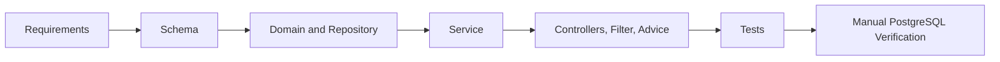

# URL Shortener Greenfield Scenario

## Intent

Deliver a small, production-shaped URL-shortener vertical slice: create a link, retrieve its metadata, resolve a public redirect, and disable the link. The slice establishes persistent identity, idempotent creation, URL safety checks, request correlation, structured API errors, and automated coverage before adding optional product capabilities.

Analytics is intentionally excluded from this initial greenfield slice. It will be introduced later as a brownfield enhancement, with its own data model, delivery semantics, privacy review, and regression coverage.

## Initial Requirements

- Accept an absolute `http` or `https` destination URL and an optional URL-safe custom alias.
- Persist unique codes and idempotency keys, with database constraints as the concurrent-write safeguard.
- Create links through `POST /api/v1/links`, return their metadata, and set `Location` to the generated short URL.
- Retrieve metadata through `GET /api/v1/links/{code}`.
- Redirect an active, unexpired public code from `GET /{code}` with `302 Found` and cache-prevention headers.
- Disable an existing link through `DELETE /api/v1/links/{code}` without deleting it.
- Return trace-aware JSON errors and keep internal exception details out of client responses.

## Ambiguities Identified

- The requirements state that `Idempotency-Key` is required, while the implemented controller accepts it as optional and the service treats a blank or absent key as no idempotency request. Product policy must resolve this before release.
- The requirements document assumes `404 Not Found` for disabled and expired links to avoid state disclosure. The implemented API returns `410 Gone` with `LINK_DISABLED` or `LINK_EXPIRED`; this behavior needs explicit product and security sign-off.
- Analytics freshness, bot policy, retention, failure behavior, and privacy scope remain open. None are part of this slice.
- Authentication, authorization, tenancy, public-endpoint rate limiting, and management-endpoint protection are unresolved production concerns.

## Task Decomposition

1. Normalize requirements, assumptions, and API acceptance criteria.
2. Define the relational schema and Flyway migration.
3. Implement the `ShortLink` entity and Spring Data repository.
4. Build service-layer creation, idempotency, collision retry, lookup, expiration, and disable behavior.
5. Add API request/response contracts, REST controllers, redirect headers, request IDs, and centralized error handling.
6. Add domain, service, repository, MVC, and full lifecycle integration coverage.
7. Validate with H2 tests, a local PostgreSQL Compose service, and manual HTTP scenarios.

## Dependency Order



## Files Implemented

- Application bootstrap and configuration: `src/main/java/com/example/url_shortener/UrlShortenerApplication.java`, `src/main/resources/application.yml`, and `src/test/resources/application-test.yml`.
- Persistence: `src/main/resources/db/migration/V1__create_short_links.sql`, `src/main/java/com/example/shortener/domain/ShortLink.java`, and `src/main/java/com/example/shortener/repository/ShortLinkRepository.java`.
- Service and validation: `ShortLinkService`, `ShortLinkWriter`, `CodeGenerator`, `UrlSafetyValidator`, `UrlValidationException`, and the domain exception classes under `src/main/java/com/example/shortener`.
- HTTP API: `CreateLinkRequest`, `LinkResponse`, `ErrorResponse`, `ShortLinkController`, `RedirectController`, `RequestIdFilter`, and `GlobalExceptionHandler`.
- Automated tests: domain, service, repository, MVC controller, redirect controller, application-context, and `ShortLinkApiIntegrationTest` classes under `src/test/java`.
- Documentation: `docs/REQUIREMENTS.md`, `docs/AI_ENGINEERING_LOG.md`, and this scenario document.

## Copilot-Assisted Activities

- Converted the initial brief into reviewable requirements and acceptance criteria.
- Generated implementation scaffolding for persistence, service, web, error-handling, and test layers.
- Added targeted repository, MVC, and integration tests, then used their failures to correct test bootstrap and H2 profile configuration.
- Ran Maven test and verification commands, started PostgreSQL through Docker Compose, started the application, and exercised the key HTTP lifecycle manually.

## Suggestions and Decisions

| Suggestion | Decision | Rationale |
| --- | --- | --- |
| Keep analytics outside V1 | Edited | Defers analytics to a brownfield enhancement with isolated migration and regression work. |
| Use Flyway-owned production schema with Hibernate validation | Accepted with review | Keeps production DDL under migration control. |
| Use a separate `REQUIRES_NEW` insert writer for collision retries | Accepted | PostgreSQL marks a transaction rollback-only after a uniqueness violation. |
| Treat a repository pre-check as the authoritative uniqueness guarantee | Edited | The database unique constraint remains authoritative under concurrency. |
| Call `Instant.now()` directly | Edited | Injected `Clock` supports deterministic expiration and error timestamp tests. |
| Treat every integrity violation as a generated-code collision | Rejected | Non-collision integrity failures must be classified or propagated. |
| Use random-output tests to prove generator uniqueness | Rejected | Statistical checks are flaky and cannot prove uniqueness. |

## Validation Performed

- `./mvnw test` was run successfully after the web and integration work; the recorded run reported 56 tests, 0 failures, and 0 errors.
- Focused MVC runs passed for `ShortLinkControllerTest` and `RedirectControllerTest` after adding deterministic test `Clock` configurations; the recorded run reported 13 passing tests.
- The focused `ShortLinkApiIntegrationTest` passed using the `test` profile with H2 in PostgreSQL compatibility mode, Flyway disabled, and Hibernate `create-drop`.
- `./mvnw clean verify` was run successfully earlier in the slice, before the later MVC and integration tests were added; it reported 44 tests, 0 failures, and 0 errors at that time.
- Local PostgreSQL was started with `docker compose up -d`. Manual requests verified `201 Created`, idempotent replay, `200 OK` metadata lookup, `302 Found` redirect with `Cache-Control: no-store` and `Pragma: no-cache`, `204 No Content` disablement, and `410 Gone` with `LINK_DISABLED` after disablement.
- `git diff --check` was run successfully after documentation changes.

## Risks and Trade-Offs

- H2 validates application persistence behavior but not exact PostgreSQL dialect or Flyway migration compatibility. PostgreSQL Testcontainers integration tests remain a required follow-up.
- The test profile disables Flyway and lets Hibernate create the H2 schema. This speeds slice tests but does not prove the production migration on a PostgreSQL engine.
- The production redirect base URL is configurable; local manual verification uses `http://localhost:8080`.
- No analytics, authorization, rate limiting, abuse protection, or tenant isolation is implemented in this slice.
- The status-code discrepancy for disabled and expired links is intentional in the current implementation but unresolved against the original requirements.

## Engineer Sign-Off Criteria

- Confirm the required-versus-optional idempotency-key policy.
- Approve `410 Gone` or change behavior to the required state-disclosure policy for disabled and expired links.
- Add PostgreSQL Testcontainers tests that run Flyway migrations and verify constraints, indexes, and transaction behavior against the production dialect.
- Add and review analytics as a separate brownfield change, including privacy, retention, bot, and delivery-failure decisions.
- Define authentication, authorization, rate limits, and management-endpoint security before production use.
- Re-run the complete verification suite after the above changes and review the resulting evidence before release.

## Runnable Lifecycle

Run PostgreSQL and the application before exercising these scenarios:

```sh
docker compose up -d
./mvnw spring-boot:run
```

The examples use `http://localhost:8080`.

### Create and Replay a Short Link

```sh
curl -i -X POST http://localhost:8080/api/v1/links \
  -H "Content-Type: application/json" \
  -H "Idempotency-Key: request-7" \
  -d '{
    "originalUrl": "https://example.com/products?id=7",
    "customAlias": "demo7"
  }'
```

Expected result: `201 Created`, `Location: http://localhost:8080/demo7`, an `X-Request-Id` header, and a JSON representation with `code` set to `demo7`. Repeat the identical request with the same key to receive the original representation without creating a second row.

### Retrieve, Redirect, and Disable

```sh
curl -i http://localhost:8080/api/v1/links/demo7
curl -i http://localhost:8080/demo7
curl -i -X DELETE http://localhost:8080/api/v1/links/demo7
curl -i http://localhost:8080/demo7
```

Expected results: metadata returns `200 OK`; the active public link returns `302 Found` with the destination `Location`, `Cache-Control: no-store`, and `Pragma: no-cache`; deletion returns `204 No Content`; the final public request returns `410 Gone` with `LINK_DISABLED`.

### Validation Failure

```sh
curl -i -X POST http://localhost:8080/api/v1/links \
  -H "Content-Type: application/json" \
  -d '{"originalUrl":"","customAlias":"invalid alias"}'
```

Expected result: `400 Bad Request` with code `VALIDATION_FAILED`, a field-level validation message, trace ID, and timestamp.