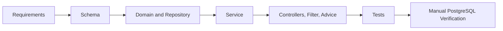

# URL Shortener Greenfield Scenario

## Intent

Deliver a small, production-shaped URL-shortener vertical slice: create a link, retrieve its metadata, resolve a public redirect, and disable the link. The slice establishes persistent identity, idempotent creation, URL safety checks, request correlation, structured API errors, and automated coverage before adding optional product capabilities.

Analytics is intentionally excluded from this initial greenfield slice. It will be introduced later as a brownfield enhancement, with its own data model, delivery semantics, privacy review, and regression coverage.

## Initial Requirements

- Accept an absolute `http` or `https` destination URL and an optional URL-safe custom alias.
- Persist unique codes and idempotency keys, with database constraints as the concurrent-write safeguard.
- Create links through `POST /api/v1/links`, return their metadata, and set `Location` to the generated short URL.
- Retrieve metadata through `GET /api/v1/links/{code}`.
- Redirect an active, unexpired public code from `GET /{code}` with `302 Found` and cache-prevention headers.
- Disable an existing link through `DELETE /api/v1/links/{code}` without deleting it.
- Return trace-aware JSON errors and keep internal exception details out of client responses.

## Ambiguities Identified

- The requirements state that `Idempotency-Key` is required, while the implemented controller accepts it as optional and the service treats a blank or absent key as no idempotency request. Product policy must resolve this before release.
- The requirements document assumes `404 Not Found` for disabled and expired links to avoid state disclosure. The implemented API returns `410 Gone` with `LINK_DISABLED` or `LINK_EXPIRED`; this behavior needs explicit product and security sign-off.
- Analytics freshness, bot policy, retention, failure behavior, and privacy scope remain open. None are part of this slice.
- Authentication, authorization, tenancy, public-endpoint rate limiting, and management-endpoint protection are unresolved production concerns.

## Task Decomposition

1. Normalize requirements, assumptions, and API acceptance criteria.
2. Define the relational schema and Flyway migration.
3. Implement the `ShortLink` entity and Spring Data repository.
4. Build service-layer creation, idempotency, collision retry, lookup, expiration, and disable behavior.
5. Add API request/response contracts, REST controllers, redirect headers, request IDs, and centralized error handling.
6. Add domain, service, repository, MVC, and full lifecycle integration coverage.
7. Validate with H2 tests, a local PostgreSQL Compose service, and manual HTTP scenarios.

## Dependency Order



## Files Implemented

- Application bootstrap and configuration: `src/main/java/com/example/url_shortener/UrlShortenerApplication.java`, `src/main/resources/application.yml`, and `src/test/resources/application-test.yml`.
- Persistence: `src/main/resources/db/migration/V1__create_short_links.sql`, `src/main/java/com/example/shortener/domain/ShortLink.java`, and `src/main/java/com/example/shortener/repository/ShortLinkRepository.java`.
- Service and validation: `ShortLinkService`, `ShortLinkWriter`, `CodeGenerator`, `UrlSafetyValidator`, `UrlValidationException`, and the domain exception classes under `src/main/java/com/example/shortener`.
- HTTP API: `CreateLinkRequest`, `LinkResponse`, `ErrorResponse`, `ShortLinkController`, `RedirectController`, `RequestIdFilter`, and `GlobalExceptionHandler`.
- Automated tests: domain, service, repository, MVC controller, redirect controller, application-context, and `ShortLinkApiIntegrationTest` classes under `src/test/java`.
- Documentation: `docs/REQUIREMENTS.md`, `docs/AI_ENGINEERING_LOG.md`, and this scenario document.

## Copilot-Assisted Activities

- Converted the initial brief into reviewable requirements and acceptance criteria.
- Generated implementation scaffolding for persistence, service, web, error-handling, and test layers.
- Added targeted repository, MVC, and integration tests, then used their failures to correct test bootstrap and H2 profile configuration.
- Ran Maven test and verification commands, started PostgreSQL through Docker Compose, started the application, and exercised the key HTTP lifecycle manually.

## Suggestions and Decisions

| Suggestion | Decision | Rationale |
| --- | --- | --- |
| Keep analytics outside V1 | Edited | Defers analytics to a brownfield enhancement with isolated migration and regression work. |
| Use Flyway-owned production schema with Hibernate validation | Accepted with review | Keeps production DDL under migration control. |
| Use a separate `REQUIRES_NEW` insert writer for collision retries | Accepted | PostgreSQL marks a transaction rollback-only after a uniqueness violation. |
| Treat a repository pre-check as the authoritative uniqueness guarantee | Edited | The database unique constraint remains authoritative under concurrency. |
| Call `Instant.now()` directly | Edited | Injected `Clock` supports deterministic expiration and error timestamp tests. |
| Treat every integrity violation as a generated-code collision | Rejected | Non-collision integrity failures must be classified or propagated. |
| Use random-output tests to prove generator uniqueness | Rejected | Statistical checks are flaky and cannot prove uniqueness. |

## Validation Performed

- `./mvnw test` was run successfully after the web and integration work; the recorded run reported 56 tests, 0 failures, and 0 errors.
- Focused MVC runs passed for `ShortLinkControllerTest` and `RedirectControllerTest` after adding deterministic test `Clock` configurations; the recorded run reported 13 passing tests.
- The focused `ShortLinkApiIntegrationTest` passed using the `test` profile with H2 in PostgreSQL compatibility mode, Flyway disabled, and Hibernate `create-drop`.
- `./mvnw clean verify` was run successfully earlier in the slice, before the later MVC and integration tests were added; it reported 44 tests, 0 failures, and 0 errors at that time.
- Local PostgreSQL was started with `docker compose up -d`. Manual requests verified `201 Created`, idempotent replay, `200 OK` metadata lookup, `302 Found` redirect with `Cache-Control: no-store` and `Pragma: no-cache`, `204 No Content` disablement, and `410 Gone` with `LINK_DISABLED` after disablement.
- `git diff --check` was run successfully after documentation changes.

## Risks and Trade-Offs

- H2 validates application persistence behavior but not exact PostgreSQL dialect or Flyway migration compatibility. PostgreSQL Testcontainers integration tests remain a required follow-up.
- The test profile disables Flyway and lets Hibernate create the H2 schema. This speeds slice tests but does not prove the production migration on a PostgreSQL engine.
- The production redirect base URL is configurable; local manual verification uses `http://localhost:8080`.
- No analytics, authorization, rate limiting, abuse protection, or tenant isolation is implemented in this slice.
- The status-code discrepancy for disabled and expired links is intentional in the current implementation but unresolved against the original requirements.

## Brownfield: Click Analytics

### Existing Behavior and Data Flow

`GET /{code}` enters `RedirectController.redirect`. `ShortLinkService.resolve` loads the link and rejects unknown, disabled, and expired codes before analytics is invoked. For an accepted link, `ClickMetadataExtractor` reads the request remote address, `Referer`, and `User-Agent`; `AnalyticsService.recordClick` persists and flushes one `ClickEvent`; then the controller returns the existing bodyless `302 Found` response.

Analytics is read through `GET /api/v1/links/{code}/analytics`. `AnalyticsService.getAnalytics` uses `requireExisting`, rather than `resolve`, so aggregates remain available for disabled and expired links. It returns exact half-open-range counts, `[from, to)`, and at most ten referrer-host aggregates. Omitted dates select the configured 30-day range ending at the current injected-clock instant; ranges ending in the future, empty or reversed ranges, and ranges over the 90-day configured maximum return `400 INVALID_ANALYTICS_RANGE`.

The existing redirect contract remains unchanged: active links return `302 Found` with the original `Location`, `Cache-Control: no-store`, and `Pragma: no-cache`; unknown links return `404`; disabled and expired links return `410`; rejected requests create no event.

### Impacted Modules

- Web: `RedirectController` records the accepted click, while `ShortLinkController` exposes the analytics endpoint.
- Service: `AnalyticsService` hashes and reduces request metadata, persists events, validates ranges, and queries aggregates; `ClickMetadataExtractor` extracts the three request inputs.
- Persistence: `ClickEvent`, `ClickEventRepository`, and Flyway migration `V2__create_click_events.sql` own the append-only event store and aggregate queries.
- API and errors: `AnalyticsResponse`, `ReferrerStat`, `InvalidAnalyticsRangeException`, and `GlobalExceptionHandler` define the analytics response and invalid-range error contract.
- Configuration: `ShortenerProperties.Analytics` supplies the IP HMAC secret plus default and maximum query ranges.

### V2 Migration

Applied migrations are immutable, so analytics was introduced through Flyway `V2__create_click_events.sql`, not by modifying V1. `click_events` contains a generated primary key, a required `short_link_id` foreign key, `occurred_at TIMESTAMPTZ`, required 64-character `ip_hash`, `referrer_host`, and `user_agent_family`. It deliberately has no cascade-delete behavior, preserving analytics after a link is disabled or expires.

Indexes support the implemented access patterns: `(short_link_id, occurred_at DESC)` supports link-specific range queries, and `(occurred_at)` supports time-based access. PostgreSQL query-plan review remains necessary before changing aggregate volume or query shape.

### Privacy Decisions

- Raw IP addresses are never stored. Each event stores an HMAC-SHA-256 value using the configured analytics secret, providing stable same-client correlation for that secret without retaining the plaintext address.
- The `Referer` is parsed and reduced to a lowercase hostname. User info, path, query, and fragment are discarded; absent or malformed values are recorded as `direct`.
- Raw user-agent strings are not retained. The stored value is only a coarse family: `bot`, `Edge`, `Firefox`, `Chrome`, `Safari`, `other`, or `unknown`.
- Cookies and forwarded-client headers are not collected. `ClickMetadataExtractor` uses `getRemoteAddr()` and intentionally does not trust `X-Forwarded-For` until a trusted-proxy boundary is approved.
- Retention, deletion, export obligations, and the business policy for bot counting still require product and privacy approval.

### Synchronous-Write Trade-Off

The redirect records an event with `saveAndFlush` before constructing `302`, giving immediate read-after-redirect visibility and preventing a redirect from being reported as successful after a silently lost accepted event. The cost is that analytics database latency and write failures are on the redirect critical path: a persistence failure prevents the redirect response. The current controller resolves and then records in separate service transactions, so disablement can race between those operations; this is acceptable only with explicit product approval or should be replaced with one transactional resolve-and-record operation.

### Regression Risks

- Analytics must not change redirect status, destination, cache headers, bodylessness, or path matching.
- Unknown, expired, disabled, and malformed-code requests must not persist events.
- Aggregates must remain accessible after disablement or expiration, without allowing a disabled or expired redirect.
- Changes to proxy handling can alter IP hashing and the privacy boundary; they require an explicit trusted-forwarding configuration.
- H2 coverage does not prove PostgreSQL `TIMESTAMPTZ`, Flyway, index, or transaction behavior.

### Tests Added

- `RedirectControllerTest` verifies exactly one analytics call for a resolved redirect, no analytics calls for rejected or malformed requests, and preserves the established redirect headers and statuses.
- `AnalyticsServiceTest` verifies HMAC IP storage, same-IP determinism, distinct-IP output, hostname-only referrers, the default range, top-referrer limit, and invalid/oversized ranges.
- `ShortLinkControllerTest` verifies the analytics endpoint delegates ISO-8601 ranges and returns the structured invalid-range error.
- `ShortLinkApiIntegrationTest` verifies two redirects immediately produce two stored events and an aggregate count of two; unknown, disabled, and expired redirects add none; analytics remains available after disablement.

### Actual Validation Results

On 2026-09-14, `./mvnw.cmd test` completed successfully: 63 tests ran with 0 failures, 0 errors, and 0 skipped tests. The repository evidence in `target/surefire-reports` includes analytics service, controller, redirect, and lifecycle integration test reports. The suite uses H2 under the `test` profile, with Flyway disabled and Hibernate `create-drop`, so it validates application behavior but not production PostgreSQL migration compatibility.

## Engineer Approval Criteria

- Approve the current synchronous-write failure contract: analytics persistence failure prevents the redirect. Otherwise implement and test the accepted-loss or asynchronous-delivery contract.
- Decide whether the resolve-then-record disablement race is acceptable, or replace it with a single transactional redirect-recording operation and add a concurrency test.
- Approve the HMAC secret lifecycle, retention period, deletion/export obligations, and whether `bot` events are included in totals.
- Approve the `getRemoteAddr()` proxy boundary before deploying behind a reverse proxy; do not accept client-controlled forwarding headers without trusted-proxy configuration.
- Add PostgreSQL Testcontainers coverage that applies Flyway V1 and V2 and verifies constraints, indexes, aggregate queries, and the chosen transaction behavior.
- Resolve the pre-existing idempotency-key requirement mismatch and the `410 Gone` versus nondisclosing `404` policy for disabled and expired links.
- Define authentication, authorization, rate limits, and management-endpoint protection before production release, then re-run the complete verification suite and review its evidence.

## Runnable Lifecycle

Run PostgreSQL and the application before exercising these scenarios:

```sh
docker compose up -d
./mvnw spring-boot:run
```

The examples use `http://localhost:8080`.

### Create and Replay a Short Link

```sh
curl -i -X POST http://localhost:8080/api/v1/links \
  -H "Content-Type: application/json" \
  -H "Idempotency-Key: request-7" \
  -d '{
    "originalUrl": "https://example.com/products?id=7",
    "customAlias": "demo7"
  }'
```

Expected result: `201 Created`, `Location: http://localhost:8080/demo7`, an `X-Request-Id` header, and a JSON representation with `code` set to `demo7`. Repeat the identical request with the same key to receive the original representation without creating a second row.

### Retrieve, Redirect, and Disable

```sh
curl -i http://localhost:8080/api/v1/links/demo7
curl -i http://localhost:8080/demo7
curl -i -X DELETE http://localhost:8080/api/v1/links/demo7
curl -i http://localhost:8080/demo7
```

Expected results: metadata returns `200 OK`; the active public link returns `302 Found` with the destination `Location`, `Cache-Control: no-store`, and `Pragma: no-cache`; deletion returns `204 No Content`; the final public request returns `410 Gone` with `LINK_DISABLED`.

### Validation Failure

```sh
curl -i -X POST http://localhost:8080/api/v1/links \
  -H "Content-Type: application/json" \
  -d '{"originalUrl":"","customAlias":"invalid alias"}'
```

Expected result: `400 Bad Request` with code `VALIDATION_FAILED`, a field-level validation message, trace ID, and timestamp.